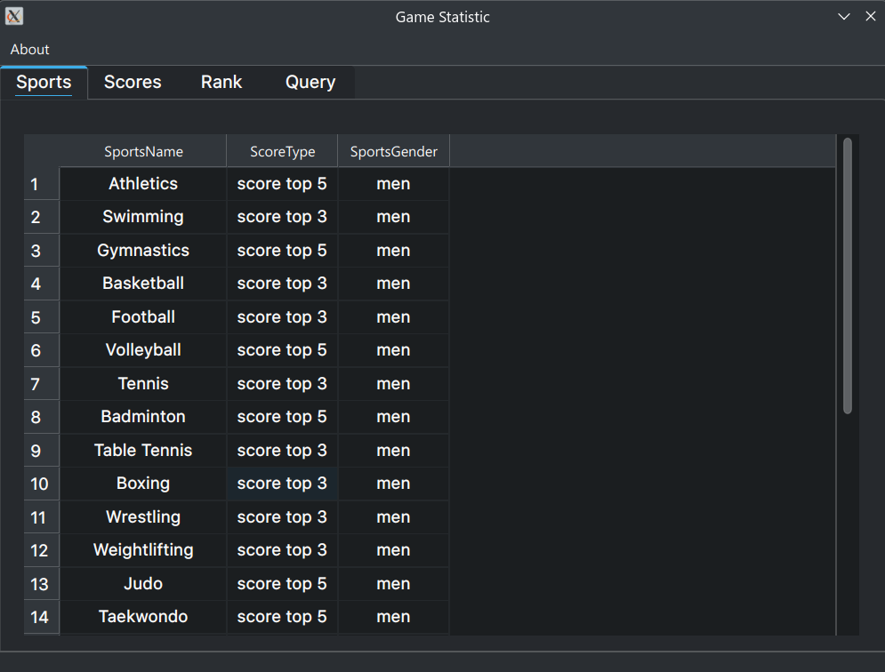
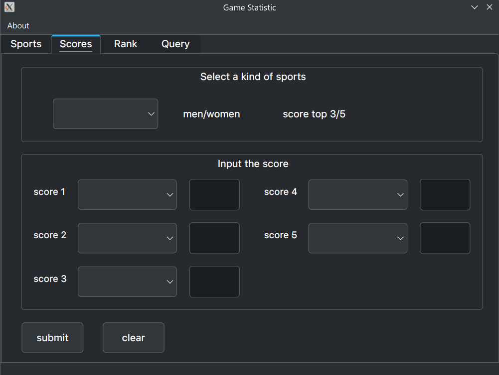
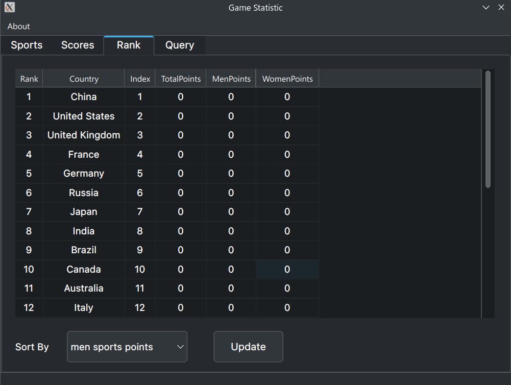
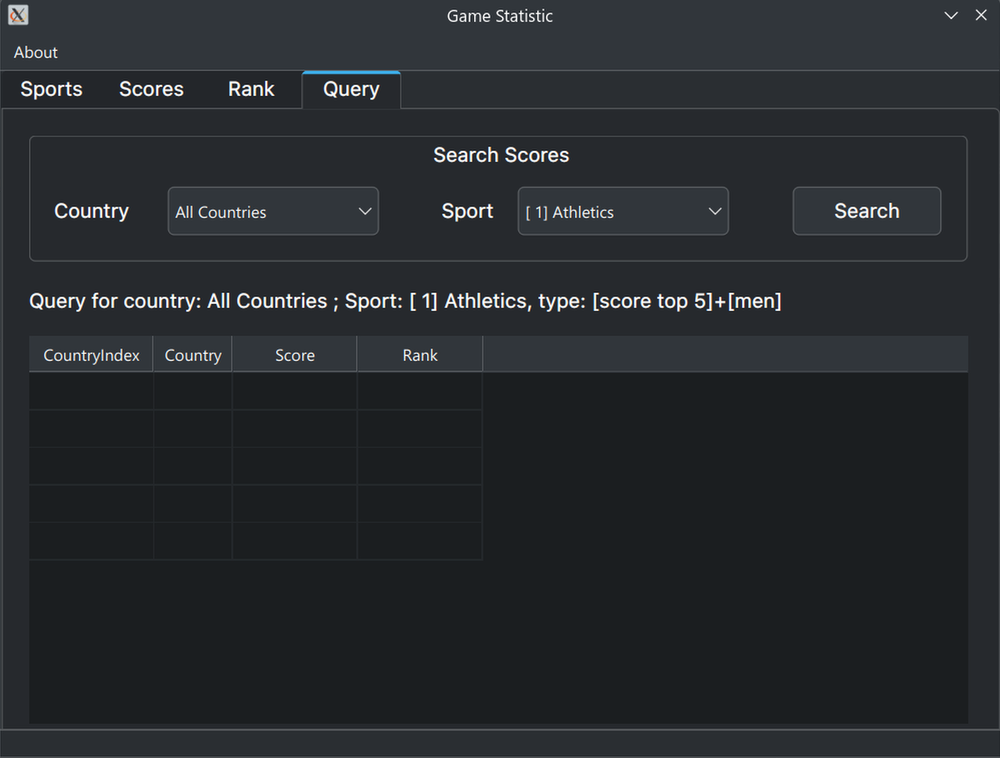

# Olympic Games Statistic

## About

这是同济大学数据结构与算法设计课程设计的第二次作业, 用于统计奥运会成绩. 

支持如下查询与输入: 

- 输入而各个项目的top3/top5的成绩

- 统计各国总分

- 按照各国总分排序输出, 按照各国编号排序输出, 按照男团体总分排序输出, 按照女团体总分排序输出

- 按照各国编号查询某个项目的情况, 按照项目编号查询获得top3/top5的国家

## Build
`clang version 18.1.8`
`cmake version 3.30.2`
`ninja version 1.12.1`
`qt6   version 6.7.2`

## Platform
Tested on `archlinux` and `Debian 12 bookworm`

### `archlinux`
`clang++(18)` with `gcc(14)`, `cmake(3.30)`
`gcc(13)`,`cmake(3.30)`

### `Debian 12`
`clang++(14)` with `gcc(12)`, `cmake(3.25)`
`gcc(12)`,`cmake(3.25)`

## Environment
本项目在`archlinux`下构建, 只保证`linux`下的正常编译运行. 实际上我已经在构建脚本中做出了检查:
- `g++ version >= 12.0.0`
- `clang++ version >= 14.0.0`
- `cmake version >= 3.25.0`
- `qt6 version >= 6.1.0`


## User Interface

- sports list


- scores input


- rank list


- query


## Local Dependencies

```
        linux-vdso.so.1 (0x00007a1b731ea000)
        libQt6Widgets.so.6 => /usr/lib/libQt6Widgets.so.6 (0x00007a1b72a00000)
        libQt6Gui.so.6 => /usr/lib/libQt6Gui.so.6 (0x00007a1b72000000)
        libQt6Core.so.6 => /usr/lib/libQt6Core.so.6 (0x00007a1b71800000)
        libGLX.so.0 => /usr/lib/libGLX.so.0 (0x00007a1b7314a000)
        libOpenGL.so.0 => /usr/lib/libOpenGL.so.0 (0x00007a1b7311f000)
        libstdc++.so.6 => /usr/lib/libstdc++.so.6 (0x00007a1b71400000)
        libm.so.6 => /usr/lib/libm.so.6 (0x00007a1b72911000)
        libgcc_s.so.1 => /usr/lib/libgcc_s.so.1 (0x00007a1b728e3000)
        libc.so.6 => /usr/lib/libc.so.6 (0x00007a1b71e0f000)
        libEGL.so.1 => /usr/lib/libEGL.so.1 (0x00007a1b728d1000)
        libfontconfig.so.1 => /usr/lib/libfontconfig.so.1 (0x00007a1b72881000)
        libX11.so.6 => /usr/lib/libX11.so.6 (0x00007a1b716bf000)
        libglib-2.0.so.0 => /usr/lib/libglib-2.0.so.0 (0x00007a1b712b2000)
        libQt6DBus.so.6 => /usr/lib/libQt6DBus.so.6 (0x00007a1b711fa000)
        libxkbcommon.so.0 => /usr/lib/libxkbcommon.so.0 (0x00007a1b711b2000)
        libpng16.so.16 => /usr/lib/libpng16.so.16 (0x00007a1b71178000)
        libharfbuzz.so.0 => /usr/lib/libharfbuzz.so.0 (0x00007a1b7105e000)
        libmd4c.so.0 => /usr/lib/libmd4c.so.0 (0x00007a1b7286b000)
        libfreetype.so.6 => /usr/lib/libfreetype.so.6 (0x00007a1b70f94000)
        libz.so.1 => /usr/lib/libz.so.1 (0x00007a1b716a6000)
        libicui18n.so.75 => /usr/lib/libicui18n.so.75 (0x00007a1b70c00000)
        libicuuc.so.75 => /usr/lib/libicuuc.so.75 (0x00007a1b70a06000)
        libsystemd.so.0 => /usr/lib/libsystemd.so.0 (0x00007a1b70912000)
        libdouble-conversion.so.3 => /usr/lib/libdouble-conversion.so.3 (0x00007a1b7168f000)
        libb2.so.1 => /usr/lib/libb2.so.1 (0x00007a1b708f4000)
        libpcre2-16.so.0 => /usr/lib/libpcre2-16.so.0 (0x00007a1b70862000)
        libzstd.so.1 => /usr/lib/libzstd.so.1 (0x00007a1b70783000)
        /lib64/ld-linux-x86-64.so.2 => /usr/lib64/ld-linux-x86-64.so.2 (0x00007a1b731ec000)
        libGLdispatch.so.0 => /usr/lib/libGLdispatch.so.0 (0x00007a1b706cb000)
        libexpat.so.1 => /usr/lib/libexpat.so.1 (0x00007a1b706a2000)
        libxcb.so.1 => /usr/lib/libxcb.so.1 (0x00007a1b70677000)
        libpcre2-8.so.0 => /usr/lib/libpcre2-8.so.0 (0x00007a1b705d8000)
        libdbus-1.so.3 => /usr/lib/libdbus-1.so.3 (0x00007a1b70587000)
        libgraphite2.so.3 => /usr/lib/libgraphite2.so.3 (0x00007a1b70565000)
        libbz2.so.1.0 => /usr/lib/libbz2.so.1.0 (0x00007a1b70f81000)
        libbrotlidec.so.1 => /usr/lib/libbrotlidec.so.1 (0x00007a1b70556000)
        libicudata.so.75 => /usr/lib/libicudata.so.75 (0x00007a1b6e800000)
        libcap.so.2 => /usr/lib/libcap.so.2 (0x00007a1b6e7f4000)
        libgomp.so.1 => /usr/lib/libgomp.so.1 (0x00007a1b6e7a1000)
        libXau.so.6 => /usr/lib/libXau.so.6 (0x00007a1b72866000)
        libXdmcp.so.6 => /usr/lib/libXdmcp.so.6 (0x00007a1b71687000)
        libbrotlicommon.so.1 => /usr/lib/libbrotlicommon.so.1 (0x00007a1b6e77e000)
```